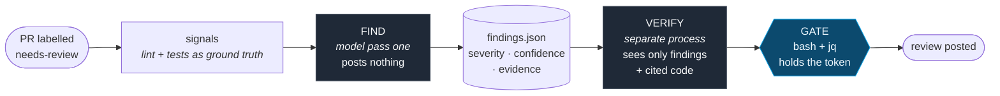

<h1 align="center">Abhishek Dubey</h1>

  <b>I build the supervision layer for autonomous coding agents.</b> 
  Control planes that keep parallel agents observable and interruptible ·
  deterministic gates that decide what a model may do with its own output.

  <a href="https://play.google.com/store/apps/details?id=me.greenlight">Mobile @ Greenlight</a> ·
  Bengaluru ·
  9 years shipping Android ·
  <a href="https://medium.com/@abhishekdubey331">Medium</a> ·
  <a href="https://linkedin.com/in/abhishekdubey331">LinkedIn</a> ·
  <a href="https://x.com/abhidubey331">X</a>

---

## Building

### Crewdeck — a local-first control plane for parallel coding agents

One detached supervisor owns every project runtime and fences each by lease identity,
restarting under a bounded crash-loop policy. A headless xterm mirrors every PTY into SQLite,
so a reconnecting browser tab replays exact prior screen state. Agent subprocess environments
are rebuilt from an allowlist, so control-plane tokens never reach an agent.

After a crash mid-rollover the daemon refuses to guess which session won: state becomes
`indeterminate` and launch is withheld until a human resolves it.

### Agentic review gates — an LLM reviewer inside a real merge gate

Running on three production repositories since May 2026.

The reviewer writes structured findings and posts nothing. A **separate** model process then
re-reads only those findings and the code they cite, and votes keep or drop — because a claim
and its refutation produced in one context share the same blind spot. A deterministic step
applies the confidence threshold, decides whether anything blocks, and holds the posting
credential the agent never sees.

---

## Selected work

**[QuizGen: AI Quiz & MCQ Test](https://play.google.com/store/apps/details?id=com.quizgenai.app)** — a production AI quiz app on Google Play, with the backend and release pipeline behind it. 
`Kotlin` `Jetpack Compose` `TypeScript` `Fly.io` `GitHub Actions` 
→ 767 and 382 commits across client and backend, 29 tagged releases, nine CI workflows — including scheduled content generation and the review gate above. This is where the agent tooling gets tested against a codebase real users depend on.

**[google-play-screenshot-skill](https://github.com/abhishekdubey331/google-play-screenshot-skill)** — turn app UI into store-ready Google Play screenshots and feature graphics. 
`Python` `agent skill` `deterministic composition` 
→ Layout is deterministic and reproducible; the model enhances at the edges rather than placing pixels.

**[ReviewRadar](https://github.com/abhishekdubey331/ReviewRadar)** — an MCP server that turns app-store reviews into prioritized product intelligence. 
`TypeScript` `MCP` `vector search` `rules + LLM` 
→ Deterministic rules handle what rules handle and the model takes only the residue, which keeps P0/P1 triage stable across runs. &nbsp;[Write-up ↗](https://medium.com/towards-artificial-intelligence/build-a-review-analytics-mcp-server-with-typescript-rules-llms-and-vector-search-15a6297e5f2a)

**Liquidity Sprint** *(private)* — a shadow execution lab for a NIFTY options scalp. 
`FastAPI` `React + Vite` `Kite Connect / Dhan` `Fly.io` 
→ There is no live order path in the codebase. Fills are modelled at the ask and the bid, statutory charges are applied, quantity is hard-capped at one lot, and completed trades land in append-only JSONL. The apparatus exists to decide whether the edge survives the spread before any capital moves.

---

## Technical interests

| | |
|---|---|
| **Supervising non-determinism** | leases, fencing, crash-loop policy, replayable state |
| **Gating model output** | deterministic thresholds, eval baselines before tightening |
| **Local-first systems** | loopback by default; anything wider is an explicit opt-in |
| **Safety rails in finance** | shadow modes, circuit-breakers, hard position caps |
| **Android at scale** | Kotlin and Compose in production, nine years |

## Stack

`Kotlin` `Jetpack Compose` `TypeScript` `Next.js` `Python` `FastAPI` `Node.js`
`SQLite` `DuckDB` `GitHub Actions` `Fly.io` `MCP`

<b>Writing</b>

- [Build a Review Analytics MCP Server with TypeScript, Rules, LLMs, and Vector Search](https://medium.com/towards-artificial-intelligence/build-a-review-analytics-mcp-server-with-typescript-rules-llms-and-vector-search-15a6297e5f2a)
- [Seamless Real-Time Location Tracking with gRPC, Kotlin & Jetpack Compose](https://medium.com/proandroiddev/building-a-real-time-location-streaming-service-with-grpc-and-kotlin-a-better-alternative-to-62563f518cc8)
- [Automate Android Login Workflows with ADB and Python](https://medium.com/proandroiddev/effortless-account-switching-automate-your-android-app-login-flow-with-python-and-adb-8a5aea83924d)
- [Event-Driven Solution in Android Without BroadcastReceiver](https://medium.com/@abhishekdubey331/building-an-event-driven-solution-in-android-without-broadcastreceiver-9ca59c4a0dbf)
- [Harnessing the Power of Kotlin Flow: Effortlessly Fetch User Location](https://medium.com/proandroiddev/fetching-user-location-using-kotlin-flow-6121557fc7b7)

